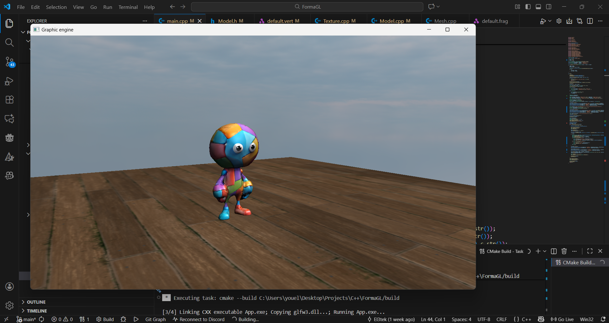

# FormaGL

<p align="center">
  
</p>

<p align="center">
  <b>Lightweight Modern OpenGL Framework for C++</b><br>
  <i>Simplifying graphics programming without the weight of a full engine.</i>
</p>

---

## About

**FromaGL** is a lightweight C++ framework built on top of modern OpenGL.  
It provides essential tools and abstractions for rendering, lighting, geometry, model loading, optimization, and basic physics — aimed at developers who want full control without rewriting boilerplate every project.

✅ Not a game engine — just the tools you need  
✅ Minimal, modular, and beginner-friendly  
✅ Currently in active development

NOTE: This project is currently a personal side project and still evolving.
---

## Features (Work in Progress)

- ✔ Window & OpenGL context creation (`GLFW`, `SDL` planned)
- ✔ Shader and material system
- ✔ Geometry utilities (Cube, Plane, Sphere, etc.)
- ✔ Texture handling and asset loading
- ✔ Basic lighting utilities (Directional, Point, Spot)
- ✔ Model loading support (`.obj` planned, `.gltf`)
- ✔ Optimized OpenGL helpers (VAO/VBO management, batching)
- ⏳ Physics module (planned)
- ⏳ Renderer presets (PBR, shadows, post-processing)
- ⏳ ECS integration
- ⏳ Debug UI (ImGui)
- ⏳ Full documentation and examples

---

## Roadmap

| Status | Feature |
|--------|---------|
| ✅ | Core windowing + input system |
| ✅ | Shader framework |
| ✅ | Basic geometry module |
| 🔄 | Model importer |
| 🔄 | Lighting framework |
| ⏳ | Physics wrapper |
| ⏳ | Full render pipeline |
| ⏳ | Example projects |
| ⏳ | First public release `v0.1` |

<br><br>
---
<br><br>

# Build & Usage

> 📌 Full build instructions will be added once the API becomes stable.  
> Current build system: **CMake** — requires **GLFW**, **GLAD**, **glm**, **stb**.

## 1. Clone the Project

You can clone the project with the default name **FormaGL** or specify a custom folder name:

```bash
# Clone the project (with optional custom folder name)
git clone https://github.com/El3tekDeveloper/FormaGL.git <project-name>

# Change directory to the project folder
cd <project-name>
```

> Example:
> ```bash
>git clone https://github.com/El3tekDeveloper/FormaGL.git MyGameEngine
>cd MyGameEngine
>```

---

## 2. Setup GLFW (Windows)

### 2.1 Download GLFW
Download precompiled binaries for your compiler from [GLFW Downloads](https://www.glfw.org/download.html).

### 2.2 Copy DLL & LIB files

1. Copy `glfw3.dll` to the **project root**.
2. Create a lib folder:
```bash
mkdir lib
```
3. Copy `libglfw3dll.a` from the compiler folder (e.g., `lib-mingw-w64`) into `lib`.

> ⚠️ Windows + MinGW only. On Linux/macOS, install via package manager:
> - Ubuntu: `sudo apt install libglfw3-dev`
> - Arch: `sudo pacman -S glfw`
> - macOS: `brew install glfw`

---

## 3. Build the Project

### Generate build files:
```bash
cmake -B build
```

### Build:
```bash
cmake --build build
```

---

## 4. Run the Project

After building:
```bash
./build/your_executable_name
```
> Replace `your_executable_name` with the generated executable name.

---

## Notes
- Ensure **GLAD, glm, stb** headers are in the correct paths.
- Linker errors usually happen due to:
  - Wrong GLFW version for your compiler
  - Missing `glfw3.dll` next to the executable
  - Missing header files for libraries